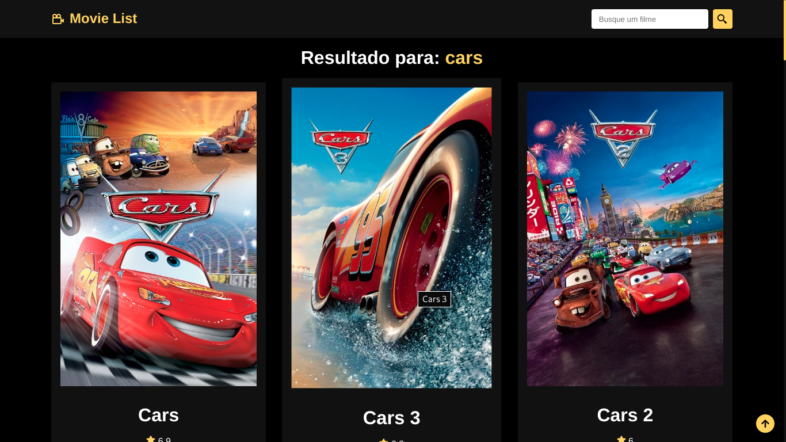
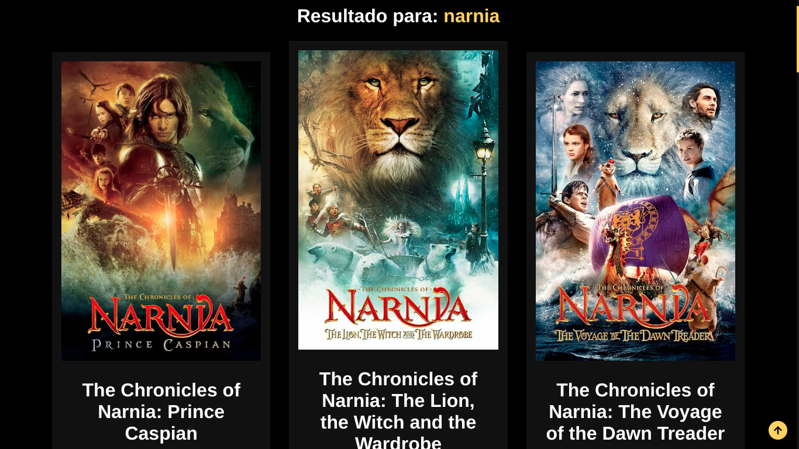
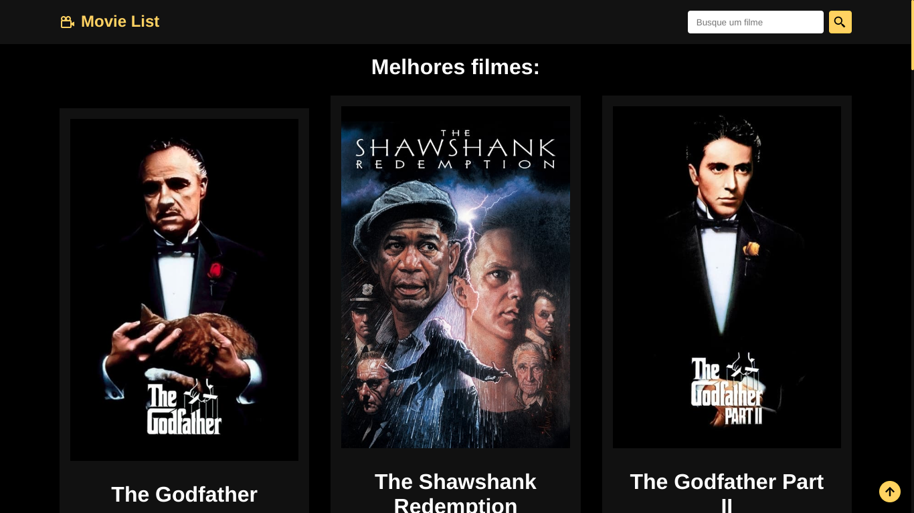
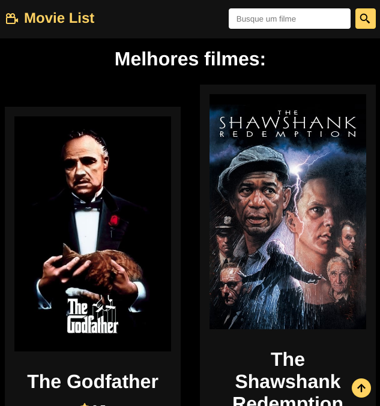

# The Movie Database (TMDB)

🇧🇷 Biblioteca de vídeos.

🇺🇸 Movie Search Website.

 ### Technologies:

 React

 TMDB

### Author [Luiz Fernando](https://www.linkedin.com/in/lfoalves/).

### For Tablet

### For Mobile

#

### Agradecimentos: ao Matheus Battisti pelo tutorial da API.

